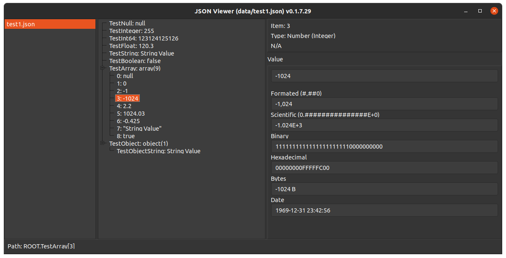

# Lazarus JSON Viewer

[](https://github.com/gcarreno/laz-JSON-Viewer/actions)
[](https://github.com/gcarreno/laz-JSON-Viewer/blob/master/LICENSE)
[](https://github.com/gcarreno/laz-JSON-Viewer/releases)
[](https://github.com/gcarreno/laz-JSON-Viewer/releases)

Simple application to view a JSON file.

**Table of contents**

- [Keys](#Keys)
- [Setup as default viewer](#setup-as-default-viewer)
  - [Linux (Unbuntu)](#linux-ubuntu)
  - [Windows](#windows)
- [Screenshots](#screenshots)


## Keys

- The `Escape` key exits the application.
- On linux the `Ctrl+Q` key combination, exits the application.
- On Windows the `Atl+X` key combination, exits the application.

## Setup as default viewer

### Linux (Ubuntu)

The quick and dirty way I did it on my system was:

1. Create a file under `$HOME/.local/share/applications` named `jsonviewer.desktop` with the appropriate contents pointing to where you have uncompressed your binary.
2. Create and entry on `$HOME/.local/share/applications/defaults.list` that looks like:

```ini
[Default Applications]
application/json=jsonviewer.desktop
```

### Windows

At the moment I don't have an answer. Need to consult some Windows gurus.

## Screenshots
One file, none selected

One file, one selected, node selected

Many files, one selected, node selected

