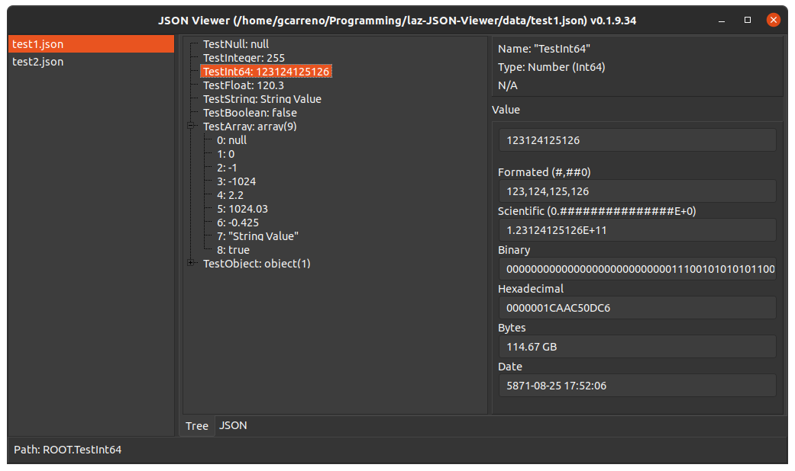
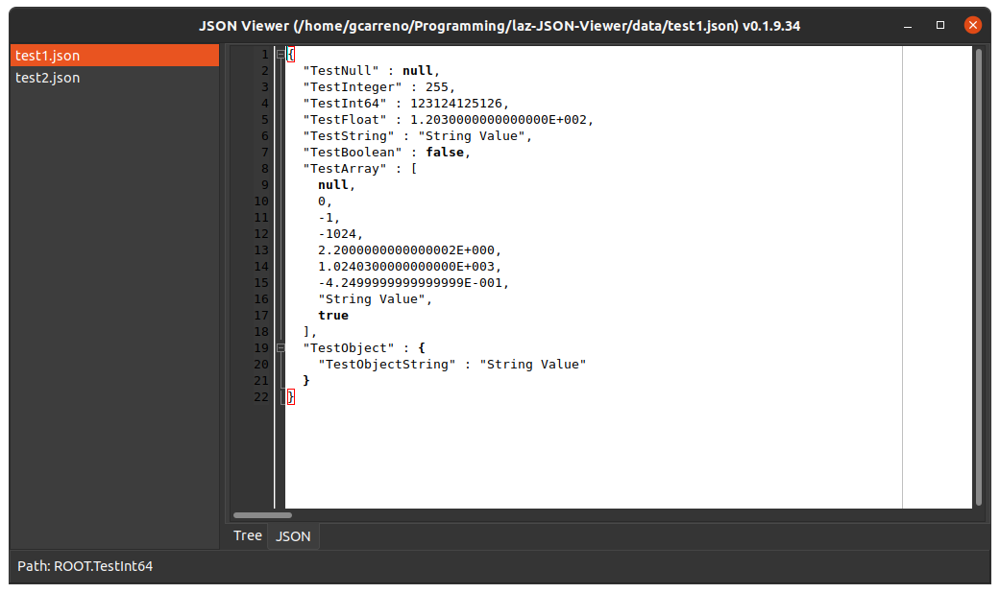

# Lazarus JSON Viewer

[](https://github.com/gcarreno/laz-JSON-Viewer/releases/latest)
[](https://github.com/gcarreno/laz-JSON-Viewer/releases/latest)
[](https://github.com/gcarreno/laz-JSON-Viewer/actions)
[](https://github.com/gcarreno/laz-JSON-Viewer/blob/master/LICENSE)
[](https://github.com/gcarreno/laz-JSON-Viewer/releases/latest)
[](https://github.com/gcarreno/laz-JSON-Viewer/releases)

Simple application to view a JSON file.

**Table of contents**

- [Features](#features)
- [Keys](#keys)
- [Translations](#translations)
- [Setup as default viewer](#setup-as-default-viewer)
  - [Linux (Unbuntu)](#linux-ubuntu)
  - [Windows](#windows)
- [Screenshots](#screenshots)

## Features

1. List of files to view
2. View JSON in tree format, Tree Tab
3. View JSON in text format, JSON Tab
4. Drag and Drop files unto the application
5. Multiple interpretations of the value
    - Numbers formated and unformated
    - Numbers displayed in Binary and Hexadecimal
    - Numbers displayed in Bytes (B, KB, MB, GB, TB)
    - Integer numbers displayed as date (UnixTime)

## Keys

- The `F12` key toggles between Tree and JSON view.
- The `Escape` key exits the application.
- On Linux the `Ctrl+Q` key combination exits the application.
- On Windows the `Atl+X` key combination exits the application.

## Translations

At the moment the available translations are for:
- Portuguese(Portugal)

If you like this application and are willing to translate it, I would be immensely grateful towards that effort!!

## Setup as default viewer

### Linux (Ubuntu)

The quick and dirty way I did it on my system was:

1. Create a file under `$HOME/.local/share/applications` named `jsonviewer.desktop` with the appropriate contents pointing to where you have uncompressed your binary.
2. Create and entry on `$HOME/.local/share/applications/defaults.list` that looks like:

```ini
[Default Applications]
application/json=jsonviewer.desktop
```

### Windows

At the moment I don't have an answer on how to do it manually. Need to consult some Windows gurus.

Nonetheless, the Windows Setup binary provided will ask you if you want to make it the default viewer for `JSON` files.

## Screenshots
- Tree view

- JSON view

